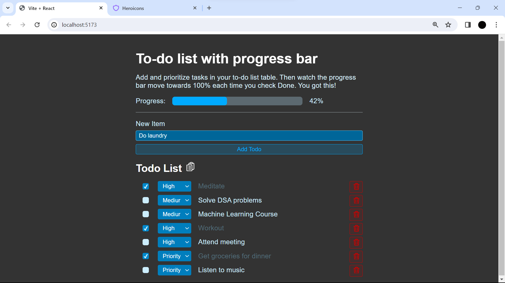

# to-do-list

TO-DO-LIST is a modern task management application developed using React and Vite. This lightweight yet powerful tool allows users to efficiently organize and track their tasks.

## Screenshots

Screenshots of the application's interface.


## Features

1. **User-Friendly Interface:**
   - Intuitive design for easy task organization.
   - Seamless navigation for a hassle-free user experience.

2. **NewTodoForm:**
   - Add new tasks effortlessly with the "NewTodoForm" feature.
   - Prevents submitting empty tasks, ensuring data integrity.

3. **TodoList:**
   - Dynamically presents tasks using individual "TodoItem" components.
   - User-friendly display with options to mark tasks as completed or delete them.

4. **Persistent Data Storage:**
   - Synchronization with local storage ensures persistent data across sessions.
   - Users can confidently rely on stored data without the risk of losing important tasks.

5. **React Hooks and Modular Components:**
   - The codebase follows React best practices.
   - Effective state management using React hooks.
   - Modular components enhance code readability and maintainability.

## How to Use

1. **Clone the Repository:**
   git clone https://github.com/vasanthsai14/to-do-list.git

# How to Use

## React + Vite

This template provides a minimal setup to get React working in Vite with HMR and some ESLint rules.

Currently, two official plugins are available:

- [@vitejs/plugin-react](https://github.com/vitejs/vite-plugin-react/blob/main/packages/plugin-react/README.md) uses [Babel](https://babeljs.io/) for Fast Refresh
- [@vitejs/plugin-react-swc](https://github.com/vitejs/vite-plugin-react-swc) uses [SWC](https://swc.rs/) for Fast Refresh

### Install Dependencies:
Download Node.js Installer:
- Visit the [official Node.js website](https://nodejs.org/).

Navigate to the project directory using the command line:

```terminal:
cd to-do-list
npm install
npm run dev

